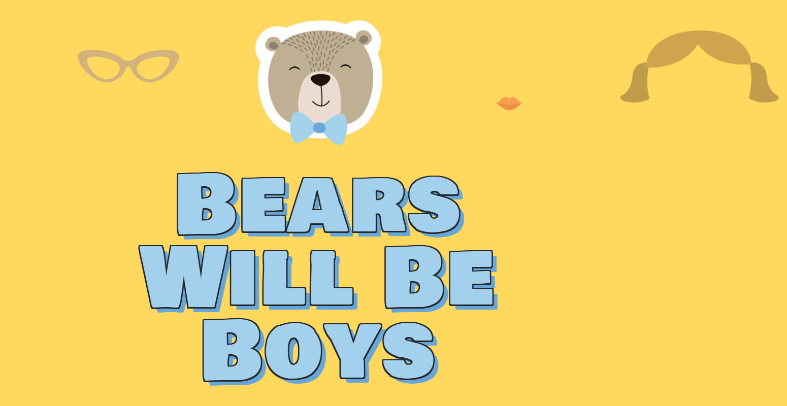
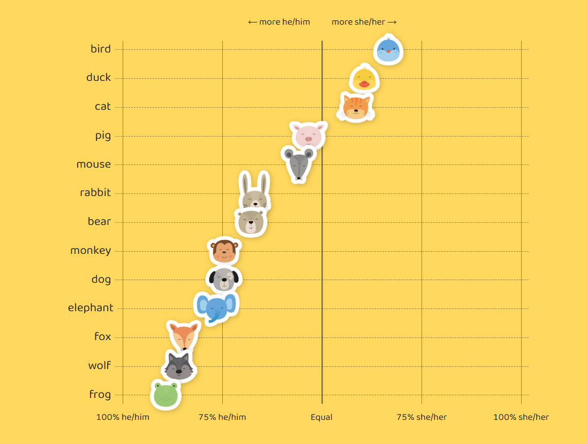
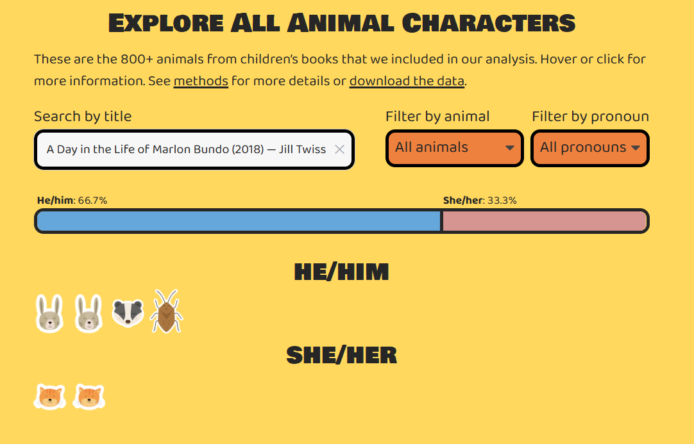
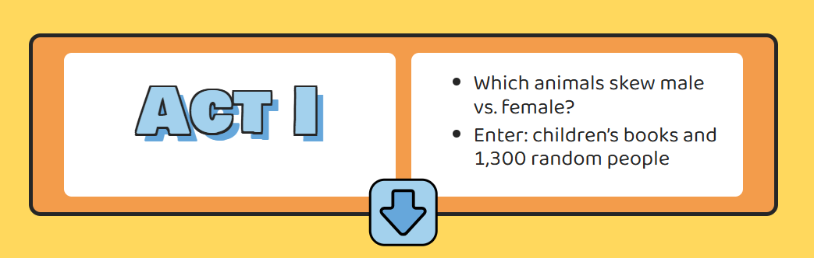

# Repositorio de tareas 
Tarea 01: 
**Bears will be boys**
1. https://pudding.cool/2025/07/kids-books/

El reportaje muestra que la mayoría de personajes de los cuentos infantiles que tienen animales como personajes, dan cuenta de un género (masculino o femenino). Solo unos pocos son llamados con nombre o sin ningún género. 
Además da cuenta de que hay ciertos animales que los identifican dentro del género masculino como el oso, perro, conejo, ranas, entre otros. En cambio, los personajes "femeninos" son siempre gatos o pájaros y aparecen mucho menos. Es una historia muy completa que cuenta con imágenes, con interacción y sobre todo, plantea datos relevantes. 

Al entrar al sitio me encantó que el oso del título se fuera disfrazando con distintos tipos de pelos, de lentes, de labios, de ropa, entre otros. 

Siento que siempre pasan muy desapercibidos los cuentos infantiles y los personajes que tienen, por ende, nunca pensé si los personajes tenían género o no. Cuando leí el título de "Bears will be boys", llegaron a mi mente muchos chalecos/polerones de niños que tienen osos dibujados o ranas, etc. Pero cuando pensé en polerones de niña, solo vi imágenes de aves u ositas con moño o vestido. Entonces, en nuestro cotidiano se usan mucho los géneros en los animales y nunca me había percatado de eso. 

Es muy curioso ir descubriendo que el machismo o dar por hecho los géneros que pertenecen a cada animal, también están presentes en los personajes de los cuentos infantiles. Había ejemplos sobre personajes gritones que siempre eran "she/her" o las que hacían trabajo de "mamá", entre otros. También, que los animales que eran mujeres se repetían y aparecían muchísimo menos en cuentos.

La narración era mediante párrafos muy breves que explican cómo los animales iban repitiendo los géneros en distintos cuentos. Además, en algunos cuentos que presentan, los géneros igual varían (antes por ejemplo el cerdo podía ser hombre, y ahora era más común que fuera mujer). La inclusión de imágenes favorece la lectura porque, al hablar sobre cuentos, uno quiere ver los personajes y la lectura, entonces lo hacía más armonioso. La cantidad de textos que se incluyeron eran muchos y muy diversos.

La inclusión de gráficos permite tener una vista más amplia sobre la cantidad de animales que aparecen en los cuentos y el género al que pertenece cada uno. De forma simple, te das cuenta que hay solo 3 animales reconocidos siempre como "mujeres". 

En un apartado, cuando se mostraban los personajes y géneros, aparecía la opción de poder buscar un texto por su título (daban varias alternativas) e ir filtrando por animales y pronombres. Lo encontré muy interesante e interactivo, porque podías ir viendo varios títulos. En mi caso vi ese de "Un día en la vida de Marlon Bundo" y descubrí que habían 4 personajes masculinos y dos gatas (mujeres). 

Por último, lo que encontré más interesante fue que los textos iban respondiendo a las preguntas que aparecían en esas cajas de texto. Por ejemplo, en lo primero salía cuáles animales se inclinaban más al género femenino o masculino. Entonces al presionar la flecha hacia abajo, aparecía el contenido que respondía a esa sección. Me gustó porque si es que no te llamaba la atención alguna sección, podías pasar a otra o ir leyendo distintas cosas. 